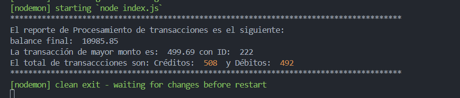

# Reto Técnico: Procesamiento de Transacciones Bancarias (CLI)

## Introducción

El siguiente programa tiene como proposito leer un archivo .csv con bastantes datos de transacciones bancarias de tipo Débito y Crédito y su respectivo monto, despues de analizar cada transacción se muestra en consola un reporte de los 3 puntos del desafio (Ver objetivo)

## Objetivo:

Desarrolla una aplicación de línea de comandos (CLI) que procese un archivo CSV con transacciones bancarias y genere un reporte que incluya:

- **Balance Final:**  
  Suma de los montos de las transacciones de tipo "Crédito" menos la suma de los montos de las transacciones de tipo "Débito".

- **Transacción de Mayor Monto:**  
  Identificar el ID y el monto de la transacción con el valor más alto.

- **Conteo de Transacciones:**  
  Número total de transacciones para cada tipo ("Crédito" y "Débito").

---

## Requerimientos

1. **Tener instalado node.js y npm**

## Instalación

1. Ejecutar en la consola el siguiente comando:

```bash
  npm install
```

## Ejecución

1. Ejecutar en la consola el siguiente comando

```bash
  npm run dev
```

2. Una vez ejecutado se visualizara en consola automaticamente el resultado del desafio
   

## Enfoque y solución

Se opto por usar la librería fs para poder leer el archivo data.csv y a su vez la librería csv-parse, para transformar el archivo a un formato en el que se pueda leer las columnas y poder leer cada fila para obtener como resultado un reporte final de las transacciones

## Estructura del proyecto

El proyecto se conforma por:

- index.js (Ejecución del programa principal)
- data.csv (Fuente de datos)
- package.json (Dependencias e información del proyecto)
- README (Instrucciones, objetivo y pasos de ejecución)
- .gitignore (Ignora carpeta especificadas para no subir a github)
- node_modules (Carpeta de npm, paqueterias)
- capturaResultado.png (Imagen del resultado del reporte)

Se opto por usar 1 solo archivo principal (index.js) donde se ejecuta toda la logica y el reporte.
